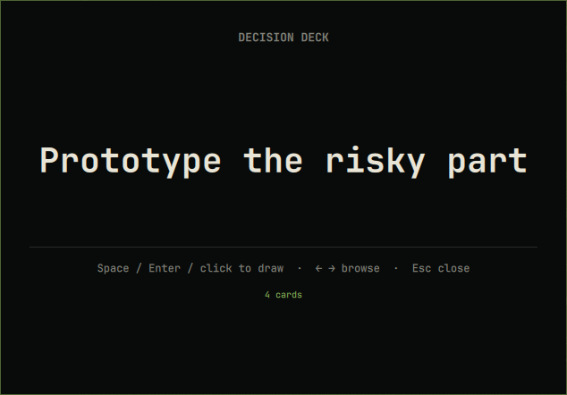

# Decision Deck

A keyboard-first decision randomizer for Omarchy Quattro. Use the built-in prompt deck or summon it with your own two-to-twelve choices.



## Install

```sh
omarchy plugin add https://github.com/rookepoole/omarchy-decision-deck.git --enable
```

## Open

Default deck:

```sh
omarchy-shell shell summon io.github.rookepoole.decision-deck '{}'
```

Custom deck:

```sh
omarchy-shell shell summon io.github.rookepoole.decision-deck '{"choices":["Tea","Coffee","Water"]}'
```

Space, Enter, or click draws; Left/Right browses; Escape closes. Payload values are display-only strings, capped at 12 choices and 80 characters each. They are never executed as commands.

## Dependencies and permissions

Requires only Omarchy Quattro and its Qt/Quickshell runtime. It makes no network requests, launches no commands, requests no privileges, and writes no files. Random draws use `Math.random()` and are playful—not cryptographic, financial, medical, legal, or safety decision tools.

## Remove

```sh
omarchy plugin remove io.github.rookepoole.decision-deck
```

## License

MIT © 2026 Rooke Poole.
